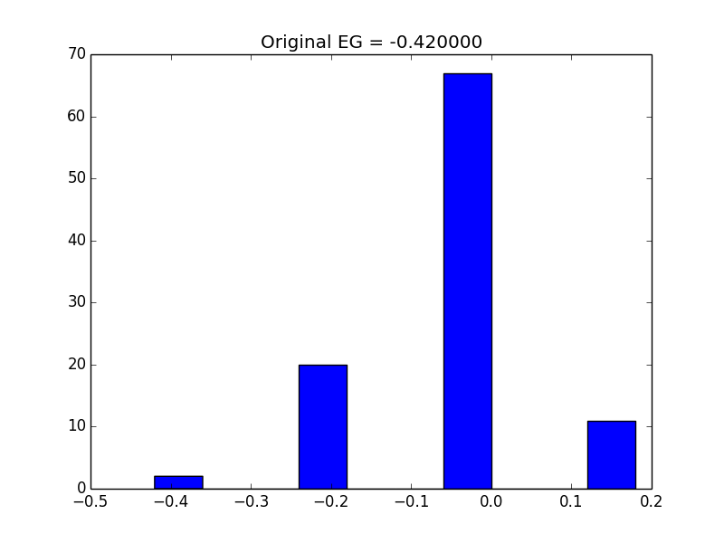

# Gerrymandering Simulator

A simulator for detecting potential bias in an MxN districting grid

## Dependencies

The only package required for running the simulator is [numpy](http://www.numpy.org/). It is installable via [pip](https://pypi.org/project/pip/):

```
$ pip install numpy
```

## Usage

The simulator takes a JSON file as input detailing the districting, see `example3x3.json` for an example 3x3 districting.

For generating 10 5-step simulations on the 3x3 grid defined in `example3x3.json`, the command would be the following:

```
$ python simulation.py --steps 5 --num-simulations 10 --file example3x3.json
```

The command line args can be viewed with the `-h` flag:

```
$ python simulation.py -h
usage: simulation.py [-h] -s STEPS -n NUM_SIMULATIONS -f FILE

Run the gerrymandering simulator on an nxn grid

optional arguments:
  -h, --help            show this help message and exit
  -s STEPS, --steps STEPS
                        Number of steps to take for the random walk
  -n NUM_SIMULATIONS, --num-simulations NUM_SIMULATIONS
                        Number of simulations to run
  -f FILE, --file FILE  JSON file representing the grid to simulate on
```

## Output

There are two units of output for the simulation. one is a file of the form `XXXXXX-results` which prints out all of the districtings that were achieved during the simulations to a file.

There is also a graph printed showing the distribution of the Efficiency Gap values for the simulation like so:


